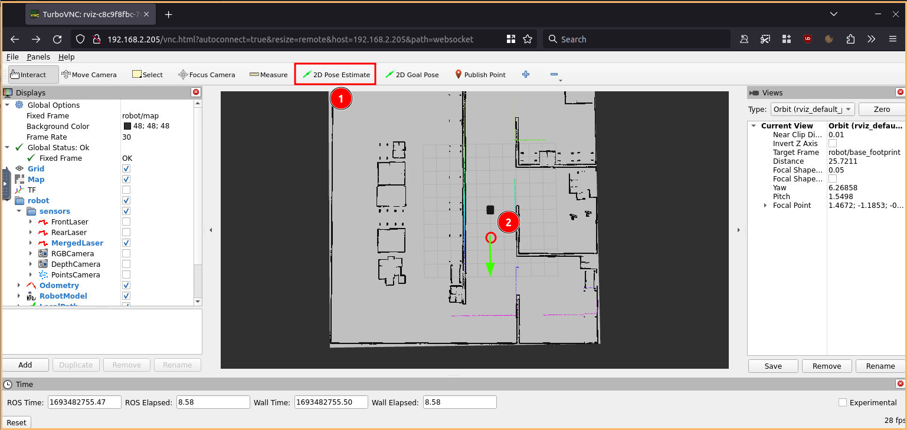
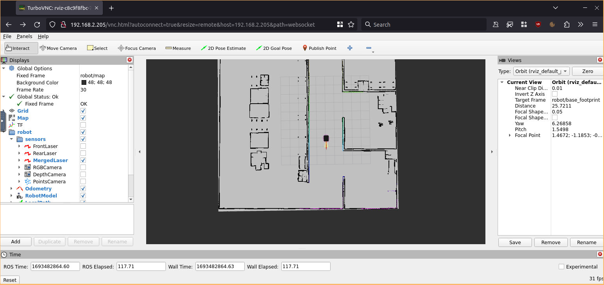
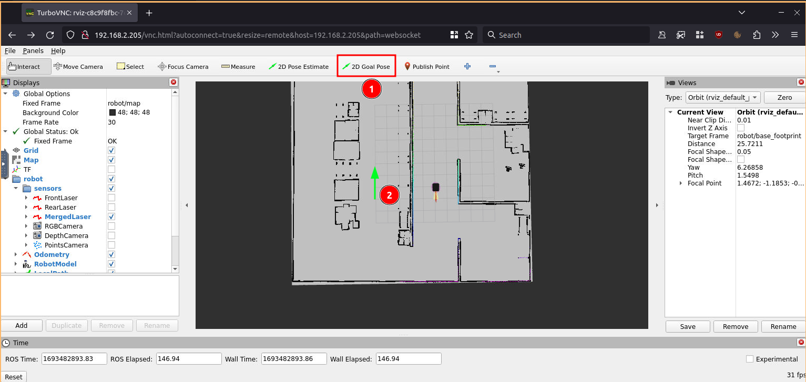
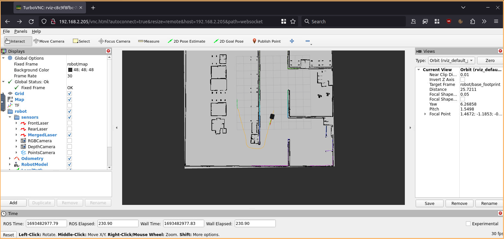
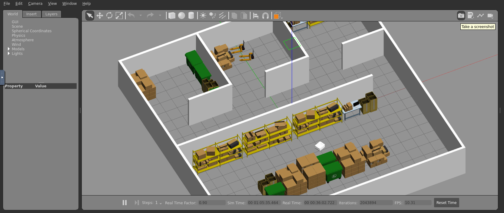

# Robotic logistics

Kubernetes manifest files for simulation of a Robotnik RB-theron on ROS2

## Requirements

- Kubernetes >=1.25
- Ingress controller
- kubectl

## Deployment

```bash
git clone git@github.com:fluidos-project/WP7_robotic_logistics.git
cd WP7_robotic_logistics/k8s
kubectl create namespace robots
kubectl apply -f pseudo-chart
```

### nginx ingress controller install
```bash
cd helm-ingress-nginx
helm repo add ingress-nginx https://kubernetes.github.io/ingress-nginx
helm upgrade \
 --install ingress-nginx ingress-nginx \
 --repo https://kubernetes.github.io/ingress-nginx \
 --namespace ingress-nginx \
 --create-namespace \
 -f values.yaml
```

## Usage

You can command the robot through rviz accessing the ingress Loadbalancer ip or url:


Step 1

Step 2

Step 3

Step 4

you also can access the gazebo interface using the ingress loadbalancer ip with path `gazebo`

Step 1

Step 2